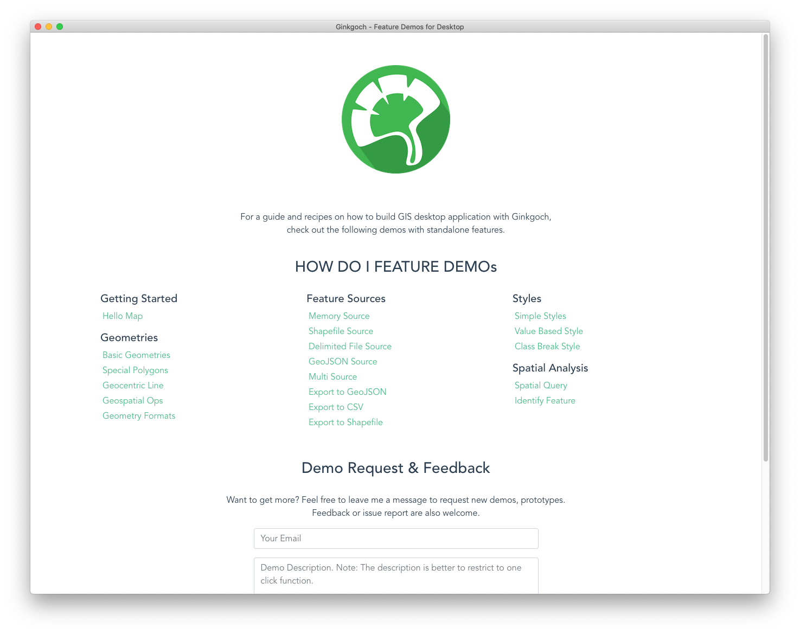
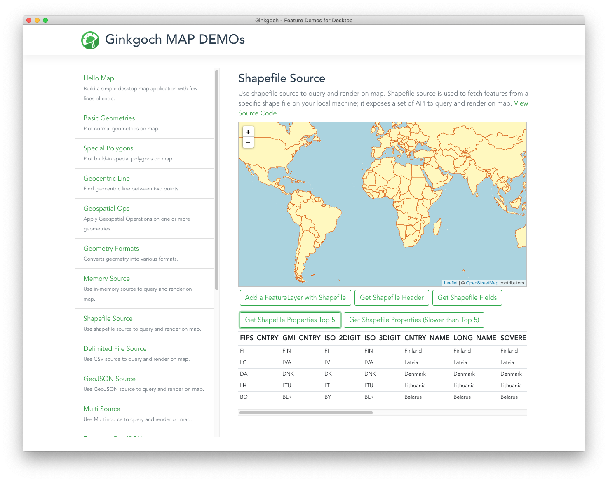
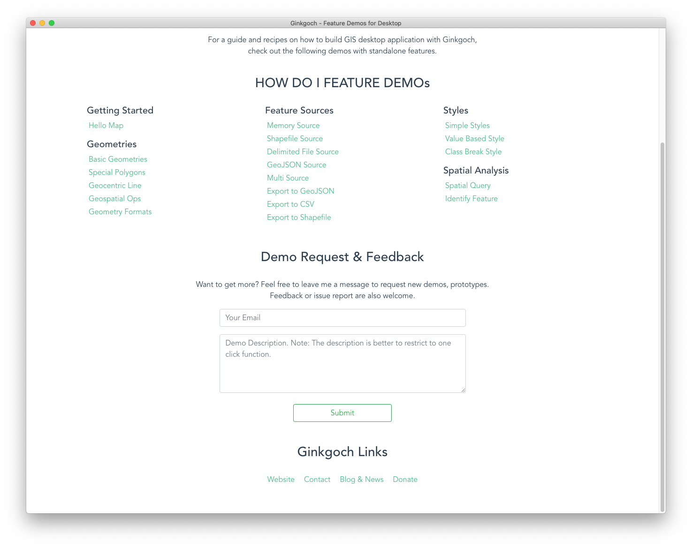

# Feature Demos for Desktop

## Overview
This is Ginkgoch MAP SDK feature demos for desktop. It includes all basic features for building a GIS application. All demos are designed as few clicks to represent what it can be done.

Here is an overview of all the demos.


## Download
This feature demo application is built with `electron` that support to run on `macOS`, `Windows` and `Linux`.

Go to the release page for the latest update. OR download directly by the links below.

* [Feature Demos for macOS](https://ginkgoch.s3.us-east-2.amazonaws.com/desktop-demo/ginkgoch-feature-demos-for-desktop-1.0.0-mac.zip)
* [Feature Demos for Linux](https://ginkgoch.s3.us-east-2.amazonaws.com/desktop-demo/ginkgoch-feature-demos-for-desktop-1.0.0.AppImage)
* Feature Demos for Windows [WIP...]

## Features
The first release includes following categories and I think they are pretty much the necessary features to build a basic GIS applications.
* `Geometries` - introduce how to use build-in geometries; create special polygons like star, square, circle etc; work with spatial operations as well as convert geometries to/from various data formats.
* `Feature Sources` - introduce how to work with various data sources on querying, analysis, exporting to another source type. Also introduce how to work with `Leaflet` to create grid tiles to form an interactive map.
* `Styles` - introduce how to use various styles to build a beautiful map.
* `Spatial Analysis` - introduce some basic features of spatial analysis. e.g. querying, identify as well as some aggregations functions.



## Debug Demo
Execute the commands below to clone the repo and launch debug env.
```
git clone git@github.com:ginkgoch/map-desktop-demo.git
cd map-desktop-demo
yarn
yarn electron:serve
```

## Build Executable
```
yarn electron:build
```

## Request Demos or Prototypes
It is welcome to submit a new demo request. I will consider it carefully to build one if it is great feature and simple enough to show the power of Ginkgoch MAP SDK.

There are several ways you could request.
1. In the downloaded application, the request form is in the middle of the page.
    
2. In my website home page [ginkgoch.com](https://ginkgoch.com), go to the `contact me` section.
3. This feature demo is open source project on github. So it is welcome to submit issues there.
4. Email me directly by [ginkgoch@outlook.com](mailto:ginkgoch@outlook.com).

Happy Mapping!
